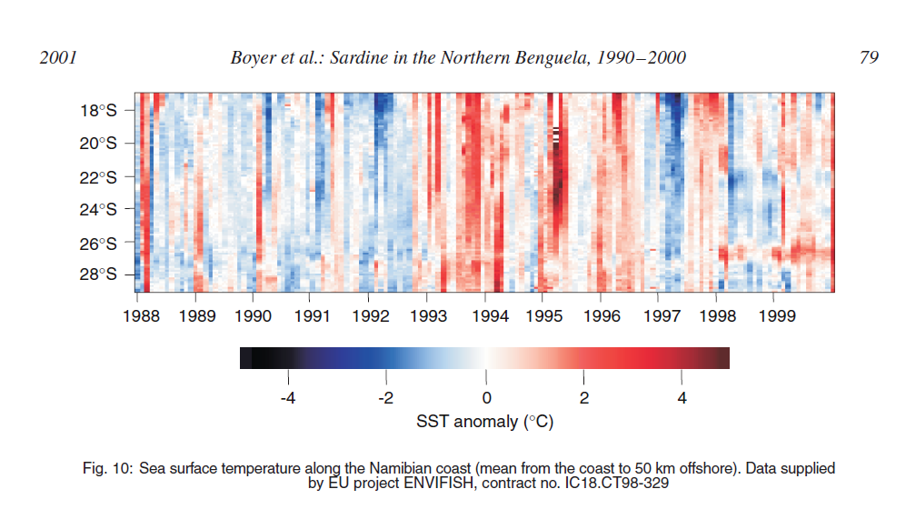

```{r setup, include=FALSE}
knitr::opts_chunk$set(echo = FALSE, warning=FALSE, results="hide", message=FALSE, fig.align="center")
```

The goal is to make a plot of SST along a transect line.  The motivation behind this is to show the spatio-temporal pattern of the SST fronts off the coast of Kochi. Boyer et al. (2001) showed a conceptually similar plot when trying explain fluations of sardine in the Northern Benguela. They were looking unusually hot nearshore temperature periods.

```{r sstfig, fig.cap="SST anomaly off the Nambian coast (nearshore).", results='asis', echo=FALSE, fig.width=6}

```


## Set up the transect

First we will set up our transect with points (lat/lon) every 10km on this line. This will use the **data.table**, **geotools** and **geosphere** packages to create equispaced points between two lat/lon points.

```{r}
library(data.table)
df <- data.frame(
  Latitude=c(9.9413972, 9.2),
  Longitude=c(76.2, 74)
  )
data.table::setDT(df)

dist.between = 10000 #in meters so 10km

library(geotools)
library(geosphere)    # for distHaversine
get.dist <- function(lon, lat) 
  geosphere::distHaversine(tail(cbind(lon,lat),-1), head(cbind(lon,lat),-1))
# The := function is in data.table
df[,dist:=c(0,cumsum(get.dist(Longitude,Latitude)))]

interp.dist <- function(var,dist) approx(dist,var,xout=seq(min(dist),max(dist),by=dist.between))$y
transect <- data.table::setDT(df)[,lapply(.SD,interp.dist,dist=dist), 
                    .SDcols=c("Latitude","Longitude","dist")]
```


Here is the transect line drawn on top of the bathymetry off the west coast. We use the **marmap** package to download bathymetry data and plot.

```{r}
library(marmap)
library(ggplot2)
xlims <- c(73,80)
ylims <- c(6,15)
bathydata<- getNOAA.bathy(xlims[1], xlims[2], ylims[1], ylims[2])

autoplot(bathydata, geom=c("r", "c")) + 
  scale_fill_etopo() +
  ylim(7,13) +
  xlim(73,79)+
  geom_point(aes(x=Longitude, y=Latitude), data=transect, alpha=1)
```

## Make a plot of mean SST from the coast

We will use the SST, Pathfinder Ver 5.2 (L3C), Day, Global, 0.0417°, 1981-2012, Science Quality (Monthly Composite). 0.0417 degrees is 4.63km approx.  The satellite data are taken from  the ERDDAP server at http://coastwatch.pfeg.noaa.gov/erddap/


```{r eval=FALSE}
### Install the rerddap packages if needed
require(devtools)
devtools::install_github("ropensci/rerddap")
devtools::install_github("rmendels/rerddapXtracto")
```


```{r}
# Load the packages.
require(rerddap)
require(rerddapXtracto)
```


```{r}
# For convenience, make shorter names for the latitude and longitude data.
xcoord <- transect$Longitude
ycoord <- transect$Latitude
```

Define the search box in the x (lon) and y (lat) directions, in units of degrees. The distance between our transect points is 10km, so our search radius should be about 5km = 0.09. Our SST data is on a 0.0417 degree grid. For this example, I use September 2009 as the date.

```{r}
xlen <- 0.1  #11 km so approx 22km
ylen <- 0.3
```


```{r}
thedate <- rep("2009-09-17", length(xcoord))
tcoord <-as.Date(thedate)
```


```{r}
dataset <- 'erdPH2sstdmday'
dataInfo <- rerddap::info(dataset)
parameter <-'sea_surface_temperature' 
```


```{r eval=FALSE}
# Download the data
dat <- rxtracto(dataInfo, 
                  parameter=parameter, 
                  xcoord=xcoord, ycoord=ycoord,
                  tcoord=tcoord, xlen=xlen, ylen=ylen)
save(dat, file="dat_sst.RData")
```

```{r echo=FALSE}
load("dat_sst.RData")
```

<!--
After it has completed the extraction the data.frame ‘dat’ will contain as many columns as datapoints in the input file and will have the following names: 

* mean =              mean of data within search radius
* stdev =             standard deviation of data within search radius
* n =                 number of points found within search radius
* satellite date =    time of returned value
* requested lon min = min longitude of call (decimal degrees)
* requested lon max = max longitude of call (decimal degrees)
* requested lat min = min latitude of call (decimal degrees)
* requested lat max = max latitude of call (decimal degrees)
* requested date =    requested time in tag
* median =            median of data within search radius
* mad =               median absolute deviation of data within search radius

-->
 

```{r}
# Shorten variable name for ease in referencing
names(dat)[names(dat)=="mean sea_surface_temperature"] <- "mean"
```

```{r}
# Set up the data frame for plotting
alldata <- data.frame(transect, time=tcoord, mean=dat$mean)
alldata$km <- alldata$dist/1000
```


```{r}
ggplot(alldata) + geom_point(aes(x=dist/1000, y=mean)) + 
  labs(x="Distance from Coast (km)", y="Mean SST (deg Celcius)",
       title=paste0("Mean SST on ", tcoord[1]))
```

## Create a colorbar of the values

Plot the colorbar with time on the axis. The data we used was 1-month averages so the colorbar width is set at 1-month.

```{r}
# fill NAs for this example
alldata$approx <- approx(x=alldata$dist[!is.na(alldata$mean)], y=alldata$mean[!is.na(alldata$mean)], xout = alldata$dist)$y
```

Dark blue is cold (low); red is hot (high).

```{r}
# Create the colorbar
cuts = 20
my.colors = colorRampPalette(c("dark blue", "yellow", "orange", "red"))
alldata$col = my.colors(cuts)[as.numeric(cut(alldata$approx,breaks = cuts))]
```


```{r}
# Plot
wid=1
xaxs <- seq(tcoord[1],by="1 month", length=2)
plot(xaxs, rep(0,length(xaxs)), 
     ylim=c(0,max(alldata$km)), type= "n", xlab = "", ylab = "Distance from coast (km)")
for(j in 1:1){
  for(i in 1:dim(alldata)[1]){
  rect(xaxs[j], alldata$km[i], xaxs[j+1], alldata$km[i+1], col = alldata$col[i],
       border=NA) 
  }
}
```

## Create colorbars for the whole year

This is a plot of the SST gradient throughout the year. Here the NAs are left as is. I download the SST data for the transect at each month in the year.  The plot shows color bars for each 1-month window. 

In the plot, we can see the formation of the cold temperature in September close to the coast. We can also see where the temperature front (sharp temperature gradient) occurs.

```{r}
thedate <- seq(as.Date("2009-01-15"), as.Date("2009-12-16"), by="1 month")
```

```{r echo=FALSE}
# downloading the Chl data takes a long time so I ran and saved the matrix to a file.
load("meanmat.RData")
```

```{r eval=FALSE}
dataset <- 'erdPH2sstdmday'
dataInfo <- rerddap::info(dataset)
parameter <-'sea_surface_temperature' 
meanmat <- matrix(NA, length(xcoord), length(thedate))
for(i in 1:length(thedate)){
  tcoord <- rep(thedate[i], length(xcoord))
  dat <- rxtracto(dataInfo, 
                  parameter=parameter, 
                  xcoord=xcoord, ycoord=ycoord,
                  tcoord=tcoord, xlen=xlen, ylen=ylen)
  names(dat)[names(dat)=="mean sea_surface_temperature"] <- "mean"
  meanmat[,i] <- dat$mean
  cat(dat$`satellite date`[1], "\n")
}
save(meanmat, file="meanmat.RData")
```


```{r colormap}
# Create a matrix like `meanmat` but with color for each value in `meanmat`.
cuts <- 50
my.colors <- colorRampPalette(c("dark blue", "yellow", "orange", "red"))
sstcuts <- as.numeric(cut(as.vector(meanmat),breaks = cuts))

# take those levels and associate with the colorpalette
cols <- my.colors(cuts)[sstcuts]

# reassemble into a matrix like meammat
colmat <- matrix(cols, length(xcoord), length(thedate))
```

```{r fig.height=4, fig.width=7}
par(mar=c(8,5,2,2))
wid=8
xaxs <- c(thedate, seq(max(thedate),by="1 month", length=2)[2])-30
n <- length(xaxs)
plot(xaxs, rep(0,n), 
     ylim=c(0,max(alldata$km)), type= "n", xlab = "", ylab = "Distance from coast (km)")
for(j in 1:length(thedate)){
  for(i in 1:dim(alldata)[1]){
  rect(xaxs[j], alldata$km[i], xaxs[j+1], alldata$km[i+1], col = colmat[i,j],
       border=NA) 
  }
}

colb <- my.colors(cuts) # our custom colors
# this bit of code gets the break points
tmp<-levels(cut(as.vector(meanmat),breaks = cuts))
tmp<-sapply(strsplit(tmp, "\\(|,|]"), function(x) as.numeric(x[-1]))
zlims<-tmp[1,]
oceanmap::set.colorbar(
  cbx=c(as.numeric(xaxs[1]), as.numeric(xaxs[n])), 
  cby=c(-100, -130), 
  pal=colb,
  zlim=zlims)
mtext("SST (deg C)", side=1, line=5)
title(paste("SST off the coast in", year(thedate)[1]))
```


